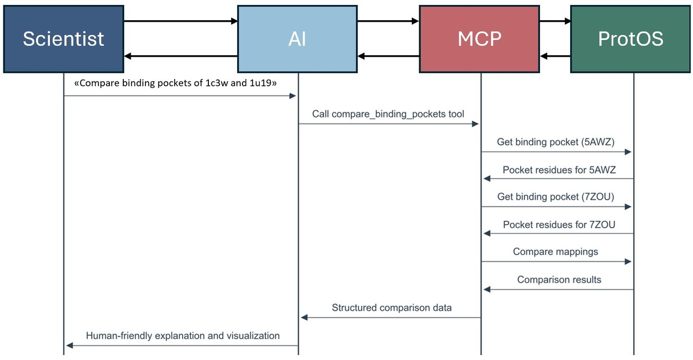

<h1 align="center">ProtOS-MCP</h1>

<p align="center">
  <b>Let LLM agents drive a structural-biology toolkit, end to end.</b><br>
  Model Context Protocol servers that wrap <a href="https://github.com/flurinh/protos">ProtOS</a> as clean, stateless JSON tools — for Claude, Ollama, or any MCP client.
</p>

<p align="center"></p>

<p align="center"><a href="https://flurinh.github.io/aboutme">◆ Portfolio</a></p>

<p align="center"><i>You may also be interested in</i></p>

<table align="center"><tr>
<td align="left">←&nbsp; <b>Previous work</b><br><a href="https://github.com/flurinh/lambda">Lambda — predicting opsin colour</a></td>
<td width="56"></td>
<td align="right"><b>Continuation of this project</b> &nbsp;→<br><a href="https://flurinh.github.io/aboutme/#rhodozyme">Rhodozyme & Cauldron — what it builds</a></td>
</tr></table>

---

## What it is

ProtOS-MCP couples the ProtOS structural-biology toolkit with **Model Context Protocol**
servers, so an agent can run structure-centric workflows from a single natural-language
request. ProtOS supplies zero-configuration processors (structures, sequences, GRNs,
ligands, properties, embeddings, graphs); the MCP layer wraps them behind **stateless JSON
tools**, and adds a **workflow recipe engine** and an **agentic-task benchmark suite**.

## ▶ See it run

**[Watch a live four-turn session](https://flurinh.github.io/aboutme/#protos-mcp)** on the portfolio:
the agent orients itself, ingests a sequence, predicts its λmax with
**[Lambda](https://github.com/flurinh/lambda)**, then engineers a redshift — redesigning the
Rhodozyme enzyme one mutation at a time.

## Getting started

```bash
pip install -e protos                 # the ProtOS library
pip install -r requirements-mcp.txt   # MCP-facing dependencies
python claude_server.py               # or: python ollama_server.py
```

Run the tests:

```bash
python -m pytest protos/tests -m "not integration"
python -m pytest mcp_server/tests -q
```

## Layout

- `mcp_server/core` — shared MCP runtime (contexts, processor factory, error types)
- `mcp_server/tools` — tool implementations grouped by analysis domain
- `claude_server.py` / `ollama_server.py` — runnable entry points
- `WORKFLOWS.md` — zero-config data flow, processor workflows, and the full tool catalog

